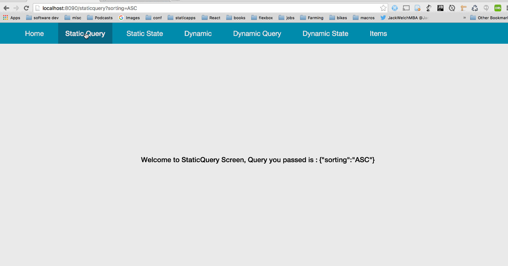

# ChangeLog 0.4.0

# Core

 - Bump scalajs version to 0.6.7
 
 - [Pure Components](../docs/PureComponents.md)

# Mobile 

 - No hacks needed for `fastOptMobile` task, it just works. - thanks to @sjrd :)

 - Upgrade to react-native [0.20.0](https://github.com/facebook/react-native/releases/tag/v0.20.0)

# Web

 - [Web Router](../docs/WebRouter.md)
   
    

# Relay

 - Upgrade to relay [0.7.1](https://github.com/facebook/relay/blob/master/CHANGELOG.md#070-february-12-2016)

# Misc

 - [Sangria-Graphql Example](https://github.com/chandu0101/sri-sangria-example)