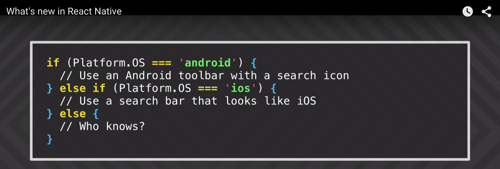

# Why no DOM dsl 

If you're wondering why sri web module doesn't come with DOM dsl then this page is for you . **In short don't use dom primitives and don't believe me!**

As we look at packages like [react-native](https://github.com/facebook/react-native), [react-art](https://github.com/reactjs/react-art), [react-canvas](https://github.com/Flipboard/react-canvas), and [react-three](https://github.com/Izzimach/react-three), it has become clear that the beauty and essence of React has nothing to do with browsers or the DOM.
To make this more clear and to make it easier to build more environments that React can render to, we’re splitting the main react package into two: react and react-dom. This paves the way to writing components that can be shared between the web version of React and React Native. We don’t expect all the code in an app to be shared, but we want to be able to share the components that do behave the same across platforms.

[DOM as a Second-class Citizen](https://www.youtube.com/watch?v=Zemce4Y1Y-A)

>Realization: React IS an extensible layout engine. It takes data as input and lays it out on the screen. 

<!-- -->

>Sometimes I feel like: If you own a browser putting abstractions INTO the DOM makes sense. If you don't, then ON TOP of the DOM makes sense.

<!-- -->

>Can someone explain why semantic markup is important? I don't buy the screen reader and search engine arguments anymore. #divallthethings ,In other words, React Native can fix a11y in other ways and hence doesn't need semantic markup.

[Initial web implementation of react-native-animated](https://github.com/facebook/react-native/commit/a50b4ea7b9ecc4c95a38b58f12a71b93ff3a3131)

[react-native-for-web](https://github.com/KodersLab/react-native-for-web)

[What's new in react-native](https://www.youtube.com/watch?v=oWPoW0gIzvs)

**well we all know , take over the world :)**

Future is now don't sit idle just **react**

#### References :

http://facebook.github.io/react/blog/2015/10/07/react-v0.14.html

https://twitter.com/sebmarkbage

https://github.com/facebook/react-native/issues/182

